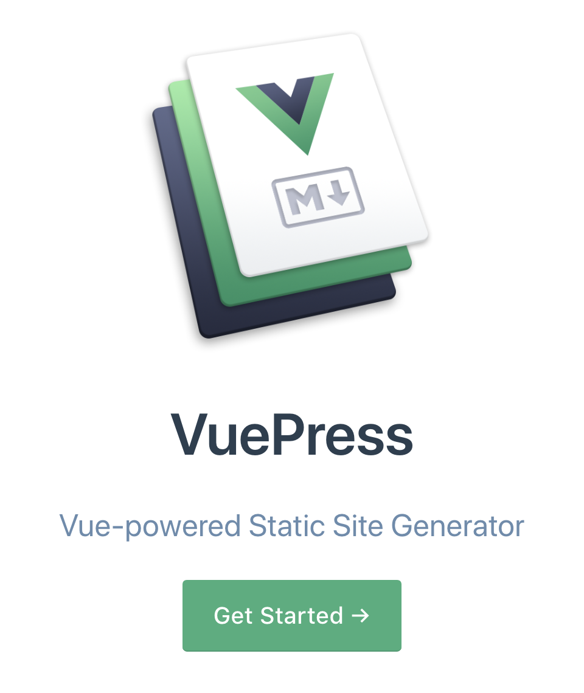
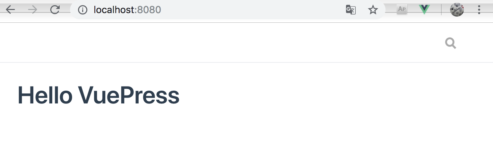
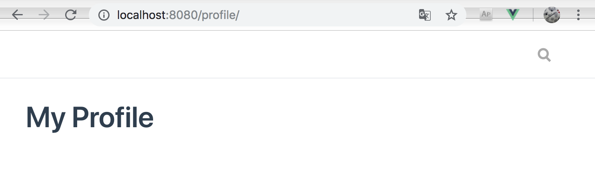

# VuePressを使用したブログ作成

本ブログはVuePressとFirebaseを使用して作成しています。  
折角なのでVuePressのインストールからFirebaseへのホスティングまでを記載します。

## 開発環境

|Name|Version|
|:--|:--|
|VuePress|0.14.8|
|npm|6.4.1|
|yarn|1.12.3|
|firebase-tools|6.1.1|
|Visual Studio Code|1.29.1|

## VuePressのインストール

VuePress公式の手順に沿ってインストールします。  
[VuePress公式](https://vuepress.vuejs.org/)

<!-- 画像サイズ指定したいからHTMLで記載 -->


```bash
# yarnを使用してVuePressを導入
yarn global add vuepress

# 試しにMarkdownファイルを表示してみる
echo '# Hello VuePress' > README.md
vuepress dev
```

上記の手順に完了後、[http://localhost:8080] にアクセスすると以下のような画面が表示されます。




ここまではかなり簡単ですね。


## プロジェクト作成

では、続いてプロジェクトとして作成して行きます。


```bash
# プロジェクトフォルダ作成(名前は任意)
mkdir vuepress-blog
cd vuepress-blog

# プロジェクト内でのVuePressインストール
yarn add -D vuepress

# ドキュメント用フォルダ作成
mkdir docs

# トップページ作成
echo '# Hello VuePress' > README.md

# package.jsonの準備
touch package.json
```

package.jsonの中身はこんな感じで作成します。

```json
{
  "scripts": {
    "docs:dev": "vuepress dev docs",
    "docs:build": "vuepress build docs"
  }
}
```

では、実行してみます。

```bash
yarn docs:dev
```

[http://localhost:8080]を開くと先程と同様にWEB画面が表示されます。


続いて別のページも作成してみます。

本ブログではプロフィールページを用意しているので、同様に作成します。

```bash
mkdir profile
echo '# My Profile' > README.md
```

先程実行した`yarn docs:dev`のコマンドを終了していなければ

保存するだけで勝手にページが適用されるはずです。

[http://localhost:8080/profile/]にアクセスしてみてください。

`/`最後のスラッシュは忘れずに入力してください。

すると、以下の内容が表示されます。



既にお気付きの方もいらっしゃるかと思いますが、docs直下がルート、

docs直下のREADME.mdがTOPページ、docs配下のフォルダがルート以下のページとして作成されます。

なので、URLを見ると`/profile/`となっており、`/profile/README.md`の内容が表示されます。


ちなみにREADME.md以外のMarkdownファイルを作成して実行すると

拡張子`.md`を`.html`に書き換えたURLにアクセスすると表示できます。

試しに以下のファイルを作成してアクセスしてみてください。

```bash
# profileフォルダ内で実行
echo '# Sample' > Sample.md
```

[http://localhost:8080/profile/Sample.html]にアクセスするとページが表示されます。